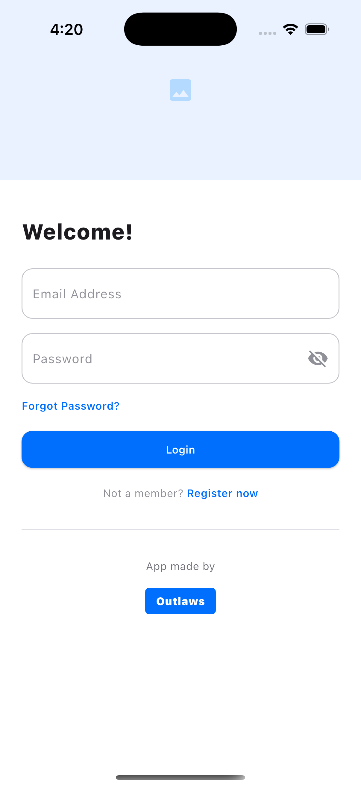
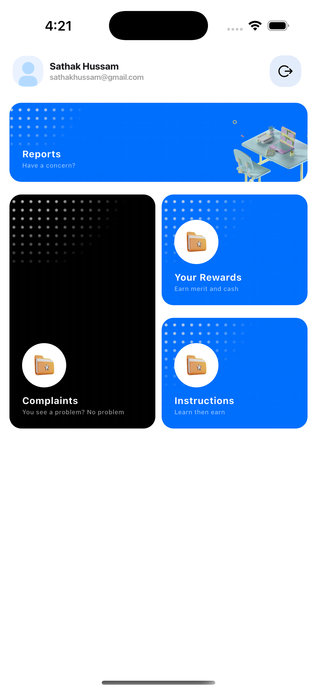
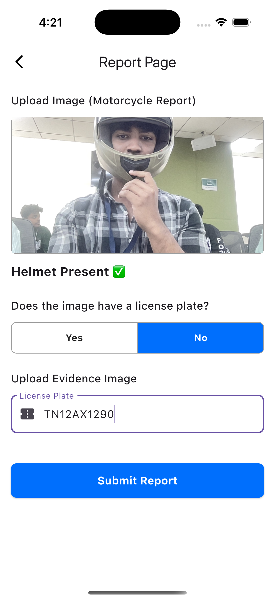
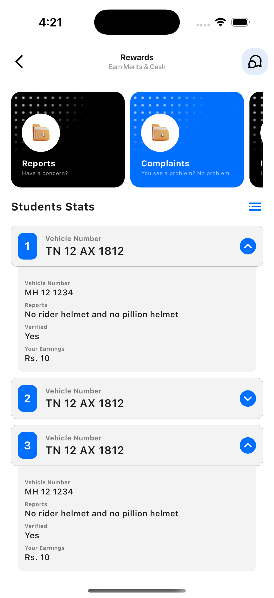

# BeBetter App

## Screenshots

| Login Screen | Dashboard | Report Page | Rewards |
|--------------|-----------|-------------|---------|
|  |  |  |  |

## Demo Video

[View Demo Video](demo-video.mov)

BeBetter is an innovative mobile application designed to enhance road safety by detecting traffic violations using advanced machine learning techniques. Leveraging a TensorFlow Lite model, BeBetter focuses on identifying common traffic infractions that are often overlooked but critical for ensuring safety on the roads. Our app currently specializes in detecting the following violations:

- **No rider helmet**: Ensures that motorcyclists are wearing helmets, significantly reducing the risk of head injuries in accidents.
- **No pillion helmet**: Verifies that passengers on motorcycles are also wearing helmets, promoting comprehensive safety measures.
- **No triples**: Detects instances where more than two people are riding a motorcycle, which is illegal and highly dangerous.
- **Missing side mirrors**: Identifies motorcycles without side mirrors, which are essential for safe maneuvering and awareness of surrounding traffic.

For the current hackathon, we have successfully implemented two key features:

1. **Helmet Detection**: Utilizing our TensorFlow Lite model, the app accurately identifies whether riders and passengers are wearing helmets. This feature is crucial for promoting helmet usage and reducing fatalities in road accidents.

2. **Complaint Logging**: Users can easily log complaints about observed traffic violations. This feature empowers citizens to contribute to road safety by reporting infractions, which can then be addressed by relevant authorities.

### Why Choose BeBetter?

- **Cutting-edge Technology**: BeBetter employs state-of-the-art machine learning models to ensure high accuracy in detecting traffic violations.
- **User Empowerment**: By enabling users to report violations, the app fosters a community-driven approach to improving road safety.
- **Scalability**: While currently focused on helmet detection, the app's architecture allows for easy expansion to detect additional types of traffic violations in the future.
- **Social Impact**: BeBetter aims to reduce traffic-related injuries and fatalities, contributing to safer roads and communities.

Selecting BeBetter means supporting a project that not only leverages advanced technology but also has a clear vision for making a tangible impact on road safety. Join us in our mission to create safer roads for everyone.
